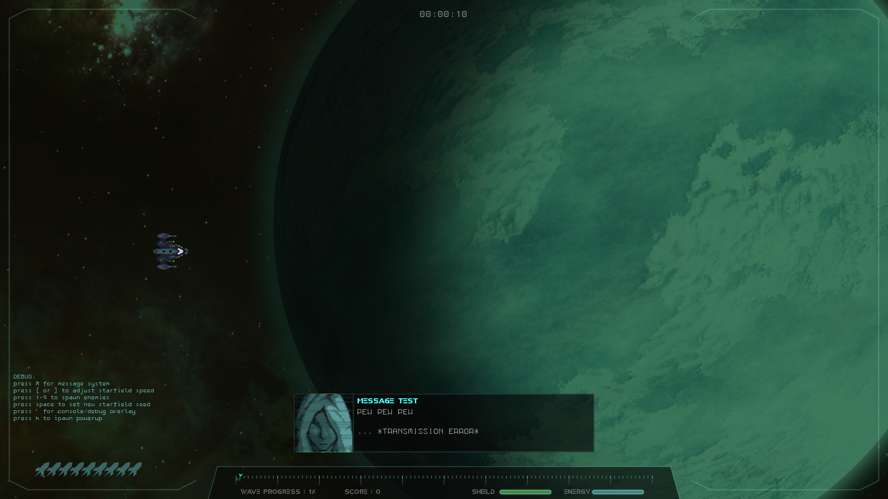

# Star Phase
A top down /side scrolling space shooter made with Lua and Love2D

This is still an early work in progress, so many bugs / changes will come.

Reccomended to use 1920x1080 resolution for now. Fullscreen display is not correctly scaled (needs working on)

### Running the game
Run the game from the src/ directory using
```
$ love src/
```

To create standalone executables for all platforms 
```
$ make && make all
```

### Requirements
Install the love2d library from here https://love2d.org

### Controls
See `binds.lua` for game controls


# License
GNU GPLv3 / CC-BY-SA


# Screenshots





